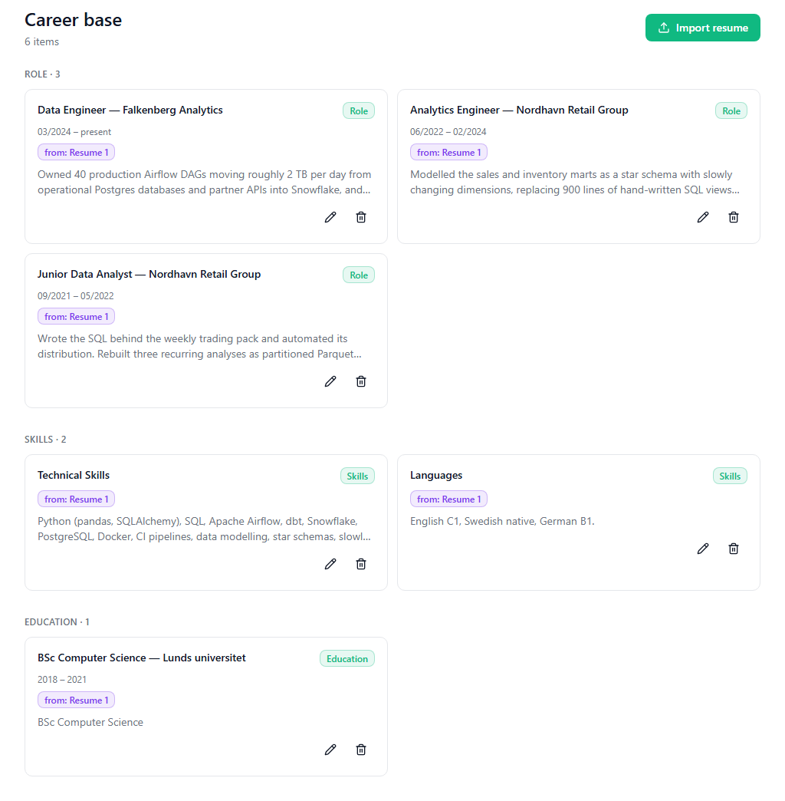

# CV Insight

An AI resume-tailoring assistant. You keep a **career base** — every role,
project and achievement you have, written once as small atomic items — and then,
for each job posting you are interested in, you paste the posting and get back an
ATS-style match score, a requirement-by-requirement coverage map, and a tailored
resume written only from what your career base actually says. Every generated
resume is checked by a second model against a rubric before you see it, and if
that check could not run the app tells you so instead of implying it passed.

Remove the models and nothing recognisable is left: parsing the posting, scoring
the match, grounding the generation and judging the result *are* the product, not
a feature bolted onto a text editor.

- **Live deployment:** running on Vercel in `fra1`, verified 2026-09-04 —
  `docs/deploy.md` records the run and the checks that passed. The URL is not
  committed to this repository: registration is closed and accounts are created by
  hand, so the link is shared directly rather than published here.
- **Specification:** `SPEC.md` is the single source of truth for build details.
- **Agent rule book:** `CLAUDE.md` constrains how the code is allowed to be
  built. On conflict, CLAUDE.md wins, then SPEC.md.

---

## The pipeline, concretely

One scan and one generation, in the order the server actually performs them. All
model traffic leaves through one connection module and two gates; nothing below
runs on the client.

### 1. Vacancy parse

`POST /api/scan` inserts a draft `applications` row *first* — so a failure still
leaves the posting saved and retryable — then sends the posting to
`anthropic/claude-haiku-4.5` in JSON mode (prompt P1, `src/lib/prompts.ts`). It
comes back as `{ title, company, requirements[], keywords[] }`, Zod-validated,
with one repair retry that appends the validation error.

Each requirement carries a `kind` (`must` / `nice`), an **evidence class**
(`tool`, `credential` or `general`) and `terms` — the verbatim names that would
prove it. Keywords and terms must be spans copied character-for-character from the
posting; `literalKeywords()` in `src/lib/scoring.ts` then **drops any keyword the
posting does not literally contain**, after Zod and before anything counts or
renders, and records the drop count. This exists because the parser was caught
returning "Quality assurance" for a posting that says "quality checks" — the app
was measuring the absence of a term it claimed to have found.

### 2. Requirement embedding

Each requirement text is embedded with `openai/text-embedding-3-small` (1536
dimensions, batched at 64 inputs per request) through `src/lib/retrieval.ts`.

### 3. Semantic match against the career base

Career items are chunked **one chunk per claim** by `src/lib/chunking.ts` — split
at bullet boundaries, at sentence boundaries, and at the separators of a dense
enumeration, into an 80–300 character band — and each chunk is one row in
`documents` whose stored `content` is `title + "\n\n" + chunk`, so an item stays
findable by its own name from any of its chunks. Requirements are ranked against
that index by `match_documents`, a `security invoker` pgvector function that
filters on `auth.uid()` inside itself, with RLS on `documents` as the fence
underneath.

Retrieval has **three** outcomes, not two: found, found-nothing, and
could-not-search. A dead embeddings call fails the whole scan with
`AI_UNAVAILABLE`; it never renders as a gap, because telling someone a
requirement is missing on the strength of a request that never completed is the
app lying about data it did not check.



### 4. The lexical evidence gate

Similarity alone decides coverage for `general` requirements. For a `tool` or
`credential` requirement, coverage **additionally** requires that one of its
verbatim terms literally appears in the career base — same word-boundary test the
keyword table uses. Absent, the row is a Gap whatever the similarity was, and the
coverage entry names the missing term so the result screen can say *why* rather
than printing an unexplained "Gap".

On a scan the corpus searched is always the **career base**, never a pasted
source resume: someone who pastes a one-page CV that omits Python still has
Python in their base, and searching the paste would manufacture a gap. (The
re-score endpoint searches a different corpus on purpose — see the limitations
below.)


Those three gaps are the gate, not the threshold: every one of them scored above
the 0.36 cut, so similarity alone would have called all three Covered. The base
does adjacent work in each case and never names the tool.

### 5. Scoring

`round(100 × (0.6 × S + 0.4 × K))`, in `src/lib/coverage.ts` and
`src/lib/scoring.ts`:

- **S** — mean over MUST requirements of `clamp((bestSimilarity − 0.20) / 0.16)`,
  where `0.16` is derived as `COVERAGE_THRESHOLD − SIMILARITY_FLOOR` so that S
  reaches exactly 1 at the point coverage turns true.
- **K** — share of the posting's keywords present in the resume text, matched
  with a word boundary applied only on the sides where the keyword itself starts
  or ends with a word character (so `C++`, `C#` and `.NET` can be counted at all).

With zero MUST requirements S is dropped and the score is `round(100 × K)`. With
zero MUST requirements *and* zero keywords there is nothing to compute from, and
the screen renders `—` rather than a hard 0.

### 6. Grounded generation

`POST /api/applications/[id]/generate` retrieves the items relevant to the whole
vacancy, then sends prompt P2 to `openai/gpt-5.4`. The retrieved items travel
inside a tagged `<items>` block that the prompt marks as data; the generator is
**not** given the keyword list, so it cannot pad the resume with terms the base
does not support. Terms the posting asks for and the base does not honestly
support are reported separately as `missingHonest` and never written into the
resume text.

### 7. The rubric judge, and its single revision

Prompt P3 sends the draft to `anthropic/claude-haiku-4.5` — deliberately a
different model *and* a different vendor from the generator, so the writer is not
grading its own work. Four criteria: grounding (pass/fail plus violations),
keyword coverage, relevance, ATS format.

The verdict is **arithmetic in `src/lib/judge.ts`, not the model's own `verdict`
field**. Grounding failure forces `revise` and cannot be compensated by high
scores elsewhere; so does any criterion at or below 2. A `revise` triggers **at
most one** regeneration, with the reviewer's specific findings appended to the
prompt. If the second draft is also refused, the app returns the **better of the
two** anyway with an honest card saying so, and the response says outright when
the rewrite was not an improvement — it does not loop, and it does not hide the
verdict.

The reviewer is held to the same standard as the writer: a term it reports as
`missingHonest` only reaches a screen or a rewrite if the career base literally
contains it, checked with the same `keywordPresent` the coverage gate uses.


That screenshot is a real refusal, not a staged one, and the run behind it is
written up in `docs/eval/generation-coverage-control.md`.

### The call budget

Model calls are metered, so they are bounded by arithmetic rather than by
convention: at most 2 HTTP requests per pipeline step
(`MAX_CHAT_REQUESTS_PER_STEP`, one shared budget for the repair retry and the
network retry — they cap, they never nest), at most 4 chat steps per generate, 50
**chat** calls per user per rolling 24 hours, and separately 100 re-score rows.
The daily chat cap counts chat steps only, by definition: embedding spend is
outside it, and the re-score endpoint — which is embeddings and no chat at all —
has the second ceiling for exactly that reason. Ceilings live in
`src/lib/budget.ts` and are unit-tested at their boundaries. There is no
debounce-driven call, no background refresh and no retry ladder anywhere: a retry
is a button someone presses.

Every OpenRouter request writes one `llm_calls` row — including failures — with
the model that *actually* answered and whether the fallback was used. `/quality`
renders that table, which is how a silently-falling-back deployment stops being
invisible.


---

## The two decisions that make this more than a wrapper

### Coverage cannot be decided by cosine similarity alone

**Evidence: `docs/eval/coverage-thresholds.md`** (three measured rounds, in the
order they happened).

The shipped thresholds were originally `0.30 / 0.55 / 0.60`, written down before
anything had been measured against this embedding model. Measured against it,
`covered ≥ 0.60` is not strict but *unreachable*: the whole band topped out near
0.43, so every requirement of every scan rendered "Gap". A dev-only probe
(`scripts/coverage-probe.mjs`) printed every requirement with its best-matching
item and the raw similarity; seven requirements of one reproducible case were
hand-labeled by reading the matched item; the thresholds were derived from those
labels, and the cost of the split is written down rather than smoothed over.

Then the harder finding. Re-chunking from one ~2,000-character blob per item to
one chunk per claim improved attribution measurably — the most requirements won
by any ONE chunk went from 5 of 8 to 3 of 8 — and it made the two known false
positives *stronger*, not weaker: *"Experience with annotation tools such as
Labelbox or Supervisely"* went 0.4280 → 0.4587 against a base containing none of
those names, and became one of the top two similarities of eight. Finer chunks
concentrate a topical match rather than diluting it, and no chunk size carries a
proper noun that is absent. Cosine similarity between short texts measures
**topic**; "worked on data labelling" and "worked in Labelbox" are neighbours in
that space. So the deciding evidence had to be lexical, which is where the gate in
step 4 came from — and the app already held that evidence one field away, in the
keyword row reading `Labelbox: 0`.

**What that file does not prove.** Seven labeled requirements, one posting, one
career base — enough to show a threshold is in the wrong place, not enough to
establish that a new one is right in general, and the file says so in its first
line. Every number is entangled with a career base that deliberately under-covers
its vacancy, so nothing there separates "the matcher is wrong" from "the corpus is
thin". The gate also introduces a *new* error in the opposite direction, named
there rather than discovered later: it matches forms, so a base writing
"Microsoft Office" or "NodeJS" does not satisfy a posting saying "MS Office" or
"Node.js", and that row becomes a false gap at any similarity. And the re-score
path reuses these thresholds against a second corpus — the unsaved editor text —
that no labeled set has ever been run against.

### The generator is measured, not assumed

**Evidence: `docs/eval/generation-model-comparison.md`.**

The configured generator, `anthropic/claude-sonnet-4.6`, had never served a single
call. A model guardrail on the OpenRouter workspace removes all of its endpoints
during routing, and because every chat call is sent as `models: [primary,
fallback]`, a blocked primary is answered by *using the fallback* — HTTP 200, a
resume comes back, and the only witness is the `llm_calls` table. Four phases of
resumes had been written by a model the project had not chosen.

So 23 slugs were probed, each requested **alone** so the answer is its own rather
than the fallback's. Five serve; eighteen return an identical
`model-ignored-by-guardrail` 404. The refused set includes `openai/gpt-5` and
`openai/gpt-4.1` while the more expensive `openai/gpt-5.4` passes — so it is an
allow-list of five, not a price ceiling: no amount of picking a cheaper or a
closer relative would have found a way through, because those five are the whole
of what is reachable and the choice had to be made inside them. A second probe sent **the app's own request body**, because
`temperature` is not in gpt-5.4's supported parameters while `reasoning` is: 149
completion tokens, **0** reasoning tokens, `finish_reason: stop`, real resume
text. A ping is not a request, and this one needed proving.

Then the part worth reading. Across three runs and six judged versions on one
fixture, **grounding fails on the first draft in 3 of 3 runs, on both models**.
The stronger generator did not fix it, which means the grounding failures are a
property of prompt P2 and/or of a deliberately under-covered career base — not an
artefact of the wrong model. **A second fixture then produced a fourth failure**
on a career base that genuinely covers its vacancy — 82, nine of twelve
requirements Covered — which looked like it left P2 as the only suspect. **Reading
the stored verdicts says otherwise, and this is the more interesting result.**
Every grounding violation that run recorded is the reviewer refusing a sentence
the career base *does* contain, because it does not name a tool the posting names;
on one of them the reviewer writes "this is not a grounding violation—it is a
coverage gap" inside the violation it is filing. So for that run the figure
measures P3's criterion boundary, not P2's faithfulness, and the three earlier
drafts cannot be checked because their accounts were deleted and only violation
counts survive. The classification, the verbatim verdicts and what they cannot
support are in `docs/eval/generation-coverage-control.md`. What did change is the revision step: under the
fallback it made grounding *worse* (3 violations → 5), under gpt-5.4 it converged
completely once (2 → 0, this project's first `approve`) and not at all once.

**What that file does not prove.** Three runs, one fixture, six versions. It is an
observation, not a benchmark, and it states that on its own first line — nothing
in it is a rate. Keyword coverage is 3/5 with `missingHonest = 5` in all six
versions, which is a statement about the corpus rather than about either writer.
The ATS score moves in opposite directions between runs and should not be read at
all. The runs used the same *case* but a fresh account each time, so it is not a
same-row comparison, and no second fixture — one whose base genuinely covers its
vacancy — has been built.

---

## Boundary rules: `scripts/check.mjs`

Thirteen rules, each one an invariant a type-checker cannot see. They are wired as
`prebuild`, so `npm run build` runs `npm run check && npm test` first and a
violation **fails the build instead of shipping**. `npm run check` prints
`check passed (13 rules):` followed by a one-line summary of all thirteen.

They are not style rules. Each one exists because the thing it forbids is
invisible when it goes wrong:

| | Rule | The failure it makes impossible |
|---|---|---|
| R1/R2 | `.from(` and `.rpc(` only inside the eight DAL files listed in `scripts/check.mjs` | one DAL per table; the database is not reachable from a page or a handler, and adding a table means adding a DAL and a line on that list |
| R3 | no `security definer` under `supabase/` | keeps `match_documents` a filter *under* RLS, not a replacement for it |
| R4 | no `NEXT_PUBLIC_` on a secret name, `.env.example` included | the one prefix that publishes a value to the browser |
| R5/R6 | no `openrouter.ai` URL and no connection import outside the two gates | a hand-rolled model call that skips the verified-user check |
| R7 | every secret reader imports `server-only` | a secret module pulled into a client component |
| R8 | no secret in `next.config.*` | that file can reach the client bundle with no prefix, so R4 and R7 both miss it |
| R9 | no `getSession(` in `src/` | it does not validate the token; only `getUser()` may gate access |
| R10 | `SUPABASE_SERVICE_ROLE_KEY` read only in `src/lib/supabase/admin.ts` | a second consumer of the one key that bypasses RLS entirely |
| R11 | `createServerClient` pinned to two files, `createBrowserClient` banned outright | a third call site that forgets `cookieOptions` downgrades the session cookie **silently** |
| R12 | a retention period on a shipped surface requires a succeeded run in `docs/eval/audit-retention-evidence.md` | the page promising an automatic deletion that nothing performs |
| R13 | every backticked repo path in a `docs/` shelf reference must resolve | a confident annotation describing a module that has never existed |

R12 and R13 are the two worth pausing on, because they are the ones that came from
being wrong. R12 exists because a `pg_cron` job scheduled against the `auth`
schema can fail with permission-denied every night and leave no user-visible
trace — a source comment saying "do not deploy this" is a configured mechanism,
not a working one, and R12 is the working one. R13 exists because three
consecutive keyword sweeps declared `docs/` clean while an annotation confidently
described a boot-time guard in a module that never existed; what makes such a note
wrong is a *property*, and a property belongs in the build.

The rule set is **frozen at thirteen**. Adding one needs an owner amendment, and
one candidate is recorded rather than smuggled in: nothing currently stops a third
`src/app/api/dev/` route shipping without its production 404 guard, so that fence
is held by code review for the two routes that exist plus the evidence run in
`docs/eval/dev-routes-production-evidence.md`.

Also in the build: `npm test` (`node:test`, zero dependencies) covers the pure
functions where an arithmetic bug would hide — scoring, chunking, the judge
verdict, the budgets, pricing, the cookie cap, the middleware matcher, and the
check rules themselves.

---

## Security and privacy posture

**Session handling.** Supabase Auth handles all sign-in; there is no custom
password code of any kind. On the server the only accepted check is
`supabase.auth.getUser()` — `getSession()` does not validate the token and R9
forbids it in `src/` entirely. Session cookies are `httpOnly`, `secure` in
production, `SameSite=Lax`, and capped at a **sliding 30 days** rather than the
library's 400-day default. That cap is enforced twice, in both cookie adapters,
because `@supabase/ssr` discards `maxAge` from the options object on write — R11
requires the clamp at both call sites and a unit test asserts it. `createBrowserClient`
is banned: it writes the session through `document.cookie`, which can never be
`httpOnly`.

**Row-level security.** RLS is enabled on all eight owner-scoped tables, every
policy scoped `auth.uid() = user_id`. The matrix is deliberately least-privilege,
and the **absences are the design**:

| Table | S | I | U | D | Why the gaps |
|---|---|---|---|---|---|
| `career_items` | ✓ | ✓ | ✓ | ✓ | |
| `documents` | ✓ | ✓ | — | ✓ | no UPDATE: re-embedding is delete-then-insert, so an upsert cannot silently half-succeed |
| `vacancies` | ✓ | ✓ | ✓ | — | |
| `applications` | ✓ | ✓ | ✓ | — | |
| `resume_versions` | ✓ | ✓ | — | — | append-only: an edit produces a new version, never mutates an old one |
| `llm_calls` | ✓ | ✓ | — | — | append-only audit log |
| `imports` | ✓ | ✓ | ✓ | — | no DELETE: removing a source would strip provenance from every item pointing at it |
| `profiles` | ✓ | ✓ | ✓ | — | no DELETE: the row dies with the account through the cascade, so a delete policy would only add a way to lose a profile without losing the account |

Absent rows answer **404, never 403** — the app does not disclose that a row
exists but belongs to someone else. `ON DELETE CASCADE` still cleans children on
account deletion; cascades are not blocked by RLS.

**The service-role key.** Read in exactly one module,
`src/lib/supabase/admin.ts`, imported by exactly one consumer:
`DELETE /api/account`. R10 pins the read site, because "exactly one module" was a
documented rule with nothing enforcing it — R7 only proves that *some* reader
imported `server-only`, which a second consumer would also do.

**Response headers.** Five, set on every response including static pages and API
handlers: `Content-Security-Policy`, `X-Frame-Options: DENY`,
`X-Content-Type-Options: nosniff`, `Referrer-Policy: strict-origin-when-cross-origin`,
`Permissions-Policy`. The CSP is built from an inventory of what the app actually
loads — no CDN, no analytics, no font host, no `public/` directory, and the
browser never contacts Supabase, which is what lets `connect-src` be `'self'`.
`script-src 'unsafe-inline'` is a **measured cost, not an assumed one**: the strict
policy was built and served first and broke all five public pages, because the App
Router streams its payload through inline `<script>` tags and blocking them kills
hydration (React error #412) while leaving pages that look right and do nothing.
Both transcripts are in `docs/eval/csp-verification.md`. A nonce was rejected for
a stated reason: it must be minted per request in middleware, and `/privacy` and
`/impressum` are deliberately outside that matcher so they stay static.

**Prompt injection.** Vacancy text, resume text and career items are interpolated
into prompts inside tagged blocks the prompts explicitly mark as data. System
prompts are built server-side in `src/lib/prompts.ts` and never travel on the
wire; no API accepts a `role` field or any prompt fragment from the client. The
judge gate limits the blast radius of anything that gets through.

**Registration is closed.** The deployment is reachable by anyone who has the URL
— the platform's password wall is not available on this plan — so the gate is new
sign-ups being **disabled in Supabase**, with accounts created by hand for named
people. That setting lives outside this repository and nothing here can enforce
it, so the app stops pretending otherwise: `/signup` keeps its route and explains,
rather than offering a form that submits into a guaranteed refusal, and `/login`
does not invite anyone to create an account. Both are fenced on `NODE_ENV`, so the
test suite still has its form in development. A demonstration notice sits on every
authenticated screen.

**Function region.** `vercel.json` pins `fra1`. The platform default is `iad1`
(Washington DC), so without it every resume would be processed in the United
States while `/privacy` named Frankfurt twice. The claim stops where it is true:
the routing layer is a global network and is not pinned by that setting, but
resume and vacancy text are only ever handled in route handlers and Server
Components, which are the pinned functions.

**Erasure.** Settings → delete account removes the auth user and every owned row.
This is **witnessed, not argued**: `docs/eval/erasure-evidence.md` records a
throwaway account populated until all eight owner-scoped tables held rows, deleted
**through the app's own control** rather than by SQL, with per-user counts taken
before and after — all eight to zero (`career_items` 8→0, `documents` 24→0,
`vacancies` 1→0, `applications` 1→0, `resume_versions` 2→0, `llm_calls` 9→0,
`imports` 1→0, `profiles` 1→0) and the `auth.users` row gone. It witnesses nothing
about data held at the model provider, and nothing about `auth.audit_log_entries`,
which survives deletion by design and has its own 90-day purge with its own
succeeded-run record.

**No analytics, no trackers, no third-party cookies.** This app ships no analytics
package, no telemetry and no web-vitals reporter — verified against a clean build
— and sets no third-party cookie. Auth cookies are strictly necessary, so no
consent banner is shown, and that is exactly why adding any tracker re-opens the
decision rather than being a settings toggle.

The limit of that sentence, because it is a promise the page makes in prose:
**one of the two settings that could inject a third-party script is a dashboard
control this repository cannot see.** A console error of exactly that shape was
observed on the deployment and traced to something the app does not ship; the two
candidates are the platform's own toolbar and its Speed Insights product, and
which one it is has not been confirmed. Speed Insights must stay off — the CSP's
`connect-src 'self'` would stop its beacon leaving, which is a reason to turn the
setting off rather than a reason to let a header keep a promise the page makes in
words. `docs/deploy.md` step 20 is the check; it is not in the deployment record
because it has not been run to a conclusion.

**The model provider caveat, stated plainly.** The OpenRouter key this deployment
uses belongs to another party. Its logging, retention and training settings
therefore cannot be verified by the operator, and `/privacy` says so in those
words instead of implying otherwise. Resume and vacancy text are transferred to
the United States, to Anthropic, OpenAI and Google; no account identifier travels
with them — not the email address, not the user id, not a session token, not a row
id. This is why the demonstration notice asks people not to paste a real resume,
and why the deployment is a demonstration rather than a service. Moving to an
operator-owned provider account retires the notice, that paragraph of `/privacy`,
and the open compliance finding behind them together.
`docs/openrouter-processing.md` is the record of what leaves, where it goes, and
which provider-account settings the deployment depends on.

---

## Running it locally

Requires **Node ≥ 22.18** and a Supabase project with the `vector` extension
enabled.

```bash
npm install
```

Create `.env.local` with these four variables. **Names only here** — values belong
in that file, which is gitignored and never committed:

```
NEXT_PUBLIC_SUPABASE_URL
NEXT_PUBLIC_SUPABASE_ANON_KEY
OPENROUTER_API_KEY
SUPABASE_SERVICE_ROLE_KEY
```

The two `NEXT_PUBLIC_` variables are the only ones that may ever reach the
browser. The other two are server-only and are read behind `import 'server-only'`;
`.env.example` carries the same four names and no values.

Apply the migrations in order, in the Supabase SQL editor:

```
supabase/migrations/001_init.sql
supabase/migrations/002_audit_retention.sql
supabase/migrations/003_imports.sql
supabase/migrations/004_profiles.sql
supabase/migrations/005_profile_contacts.sql
```

**Known caveat before you run them.** `001_init.sql` installs and uses the
`moddatetime` extension for the `updated_at` touch triggers, and that extension
was *not* available on the project this app actually runs against —
`004_profiles.sql` was rewritten to work without it and the other three were not
re-read. So the committed set is not confirmed to apply cleanly to a fresh
project, and if `001` fails on its second line that is this, not you. It is
tracked as `p4-27` in `docs/backlog.md`, and SPEC Block C reproduces the same
file verbatim, so the specification carries the assumption too.

Then:

```bash
npm run dev          # http://localhost:3000
npm run check        # the thirteen boundary rules
npm test             # node:test unit suite
npm run build        # runs check + test first, via prebuild
npm run test:e2e     # Playwright — see the caveat below
```

Sign up at `/signup` (available in development), add a few career items or import
a resume PDF at `/career`, then paste a posting at `/scan`.

**The Playwright suite needs a project with registration open.** All four specs
create a throwaway account through the `/signup` form, so they cannot run against
the deployed project — see the note at the end of
`docs/eval/phase-6-e2e-run.txt`. Point them at a development Supabase project that
allows sign-ups, or pre-create accounts and have the specs sign in instead.

`docs/deploy.md` is the ordered deployment procedure and its verification
checklist.

---

## Optional scope taken on

Beyond the core pipeline, and each one built rather than sketched:

- **PDF resume import with provenance** — server-side text extraction, an LLM
  split into typed career items, a review step that writes nothing until it is
  confirmed, an exact-duplicate guard, and an `imports` row so every item can say
  where it came from.
- **`.docx` export** of the edited resume, with a contact header composed by the
  app and never sent to a model.
- **`/quality`, an LLM observability dashboard** — per-step call counts, token
  usage, real cost in micro-USD, fallback flags and rubric outcomes, computed by
  unit-tested arithmetic because a screen whose whole job is evidence cannot rest
  on untested maths.
- **Cross-user isolation, verified** — a Playwright case in which user B is
  refused user A's *real* application id on both a read and a metered write.
- **GDPR posture** — a complete `/privacy`, an `/impressum` route (whose operator
  details are not filled in yet — see the limitations below), an EU processing
  region, and the erasure evidence above.

---

## Honest limitations

**The calibration is small.** The similarity thresholds rest on seven labeled
requirements from one posting against one career base. The generation comparison
rests on three runs and six judged versions on one fixture, and the control that
answers it rests on **one** run on a second fixture. Every one of those files says
so on its own first page. None is a benchmark, no accuracy figure should be quoted
from any of them, and the numbers are expected to move when a third case is
labeled.

**What the judge does and does not catch.** It catches claims with no career item
behind them — that is the grounding criterion, and a failure there cannot be
compensated by high scores on the other three. It catches keyword padding, because
the generator is never handed the keyword list and terms the base does not support
are reported separately instead of written into the resume. What it does **not**
do: it is one model's reading of one draft, with a single revision behind it and no
loop. Its ATS-format score moved in opposite directions across two runs of the
same fixture and should not be read.

**And the criterion boundary leaks, which is the most important limitation on this
page.** On the covering fixture, all three grounding violations were the reviewer
refusing sentences the career base *does* contain, because they did not name a
tool the posting names — a coverage judgement, filed as a faithfulness one. The
reviewer identified one of them correctly and filed it anyway, in its own words:
"Resume does NOT claim Kafka, so this is not a grounding violation—it is a
coverage gap." Strip those and that draft's grounding is clean. So the headline
figure — a first-draft grounding failure in 4 of 4 measured runs — is **not**
usable as evidence that the generator over-claims: one of the four is a
measurement of the reviewer, and the other three cannot be checked because their
throwaway accounts were deleted and only violation counts survive. It remains an
open finding, and what it is a finding *about* is now the open question.
`docs/eval/generation-coverage-control.md` carries the verdicts and the counts.
The narrowing this suggests is deliberately not made: changing the criterion would
invalidate every rubric number taken against it, so it is backlog `p7-1`.

It also cannot verify that anything in the career
base is *true* — grounding means "supported by what you wrote", not "supported by
reality".

**The coverage gate matches forms, not meanings.** A base writing "Microsoft
Office", "PostgreSQL" or "NodeJS" does not satisfy a posting saying "MS Office",
"Postgres" or "Node.js". Casing is handled; spacing, punctuation and abbreviation
are not, and it cannot be fixed by loosening the match, because a substring test
would let "SQL" satisfy "MySQL". Two candidate fixes are in the backlog and both
are new mechanisms.

**The re-score path is uncalibrated.** `POST /api/applications/[id]/rescore`
compares requirements against the unsaved editor text — same embedding model, same
units, same distance measure, so reusing the thresholds is a defensible argument,
but an argument is not a measurement. Part of any change in the ring after a
re-score is the change of corpus, not the change of text.

**Erasure is account-level.** Career items are individually deletable; job
postings, scans, generated versions, import records and usage rows go with the
account. `/privacy` states this rather than implying the erasure story is
complete. It is carried deliberately — with registration closed the store holds
one person's own data — and it reopens the moment a second real person holds an
account.

**The committed migrations are not confirmed against a fresh project.** See the
caveat under *Running it locally* and `p4-27` in `docs/backlog.md`. The schema
this app runs on and the schema in `supabase/migrations/` agree on everything the
app reads; what is unverified is whether the files apply cleanly from empty.

**The operator is not yet named on the deployment.** `IMPRESSUM_FILLED` is
`false`, so `/impressum` states that the operator's details are not published —
which is accurate, and is not a substitute for filling them in. `docs/deploy.md`
step 21 makes that a precondition of sharing the link.

**Two open defects the sections above read past, named here so they are not a
surprise.** The career-item `[id]` route does not parse its segment, so a
malformed id answers 500 where the error table mandates 404 — the 404-never-403
rule above is true of absent rows and not yet of malformed ones. And
`POST /api/career/import` spends its model call before the career-base cap can
refuse the save, so hitting the cap through an import costs money. Both are
`M-3` and `M-4` in `docs/backlog.md`, both open since Phase 2, and both are at
the top of that file for the same reason they are here.

**Password reset is not implemented.** It needs email delivery, which is out of
scope; accounts are created by hand.

**English only.** The UI and generated resumes are English. A non-English posting
parses, and the resume is still written in English.

**Model calls have no per-version provenance.** `llm_calls` records which model
answered each call, and `resume_versions` has no model column, so "written by" is
a statement about the application's most recent generation rather than about the
version on screen. That is also what stops `/quality` from reporting rubric
outcomes *by model*, which is the measurement that would answer whether the
fallback really fails grounding more often.

**Not built, deliberately:** payments, i18n, realtime, notifications, analytics,
an admin panel. `SPEC.md`'s module checklist gives the reason for each. Agentic
tool-calling retrieval is the eighth and is not on that list — it is a Phase-2
guardrail in `CLAUDE.md`, binding if it is ever built. There is no application
cron either, but that is not the same as none: the 90-day purge of the
authentication audit log is a scheduled job, and it is the one scheduled thing
this repository has. `docs/backlog.md` is the maintained list of everything else
known and open, grouped by what would reopen it.

---

## Repository map

```
SPEC.md                  the specification — single source of truth for build details
CLAUDE.md                the rule book constraining how the code may be built
scripts/check.mjs        the thirteen boundary rules, wired as prebuild
src/middleware.ts        route protection; refreshed session cookies on every branch
src/app/api/             route handlers (Block D)
src/lib/openrouter/      the single connection to OpenRouter — no auth opinion
src/lib/chat.ts          GATE: completions, verified user first
src/lib/retrieval.ts     GATE: embeddings, verified user first
src/lib/db/              one DAL per table — the only files allowed to reach the database
src/lib/prompts.ts       P1–P3, literal, server-side only
supabase/migrations/     schema, RLS policies, the pgvector match function
tests/unit/              node:test — the pure functions where arithmetic bugs hide
tests/e2e/               Playwright
docs/eval/               calibration notes and evidence runs
docs/reviews/            one review report per pull request
docs/backlog.md          what is known, open, and why
docs/deploy.md           the ordered deployment procedure and its verification
docs/openrouter-processing.md   what leaves this deployment, and where it goes
```
